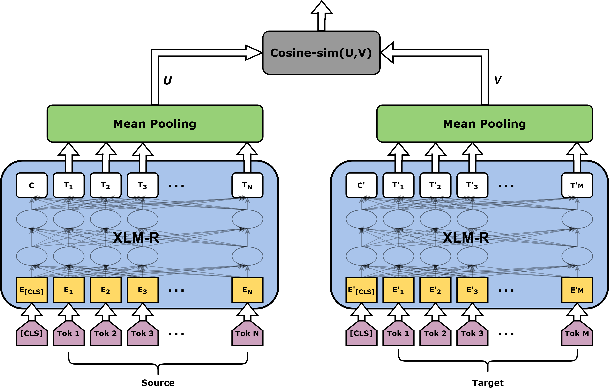

# TransQuest Architectures
We have introduced two architectures in the TransQuest framework, both relies on the XLM-R transformer model.

##MonoTransQuest

The first architecture proposed uses a single XLM-R transformer model. The input of this model is a concatenation of the original sentence and its translation, separated by the *[SEP]* token. Then the output of the 


### Minimal Start for a MonoTransQuest Model

First read your data in to a pandas dataframe and format it so that it has three columns with headers text_a, text_b and labels. text_a is the source text, text_b is the target text and labels are the quality scores. Then initiate and train the model like in the following code. train_df and eval_df are the pandas dataframes prepared with the above instructions.

```python
from transquest.algo.transformers.evaluation import pearson_corr, spearman_corr
from sklearn.metrics import mean_absolute_error
from transquest.algo.transformers.run_model import QuestModel
import torch

model = QuestModel("xlmroberta", "xlm-roberta-large", num_labels=1, use_cuda=torch.cuda.is_available(),
                               args=transformer_config)
model.train_model(train_df, eval_df=eval_df, pearson_corr=pearson_corr, spearman_corr=spearman_corr,
                              mae=mean_absolute_error)
```
An example transformer_config is available [here.](https://github.com/TharinduDR/TransQuest/blob/master/examples/wmt_2020/ro_en/transformer_config.py). The best model will be saved to the path specified in the "best_model_dir" in transfomer_config. Then you can load it and do the predictions like this. 

```python
model = QuestModel("xlmroberta", transformer_config["best_model_dir"], num_labels=1,
                               use_cuda=torch.cuda.is_available(), args=transformer_config)

```
##SiameseTransQuest 



### Minimal Start for a SiameseTransQuest Model