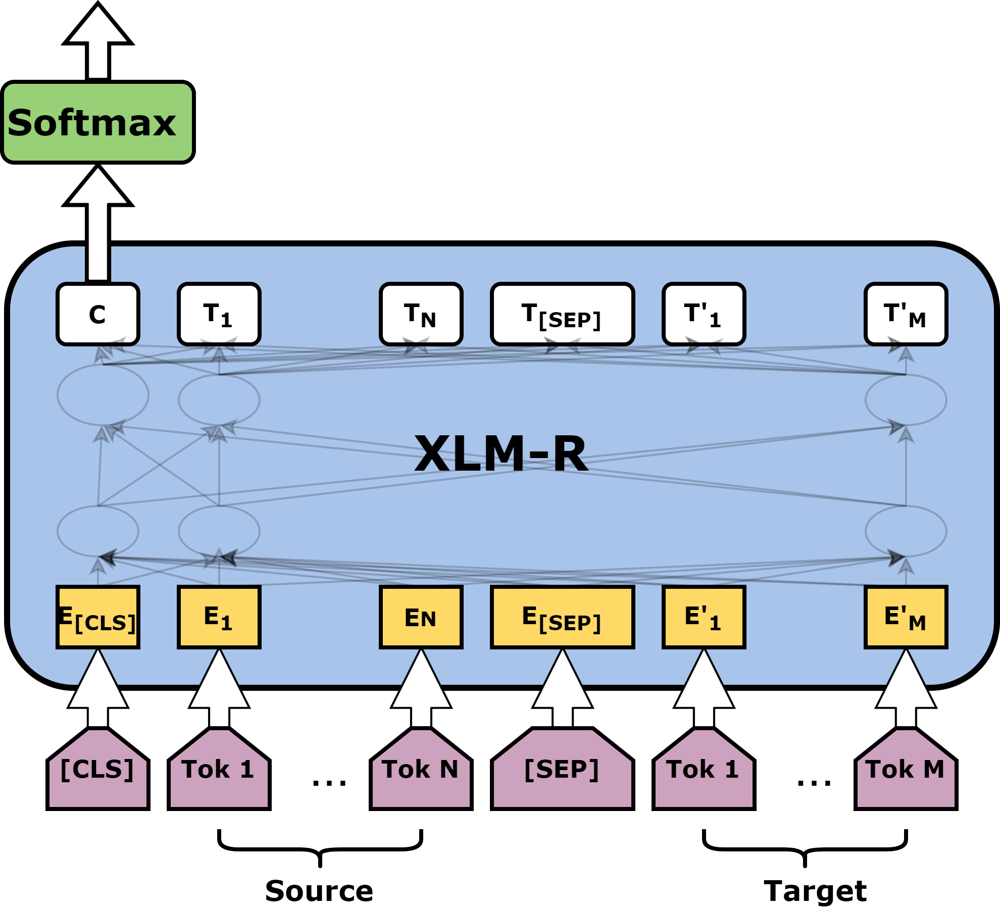

# Sentence Level TransQuest Architectures
We have introduced two architectures for the sentence level QE in the TransQuest framework, both relies on the XLM-R transformer model.

### Data Preparation
First read your data in to a pandas dataframe and format it so that it has three columns with headers text_a, text_b and labels. text_a is the source text, text_b is the target text and labels are the quality scores as in the following table.

| text_a                                                                    | text_b                                                                                       | labels |
| ------------------------------------------------------------------------- | ---------------------------------------------------------------------------------------------|--------|
| 	නමුත් 1170 සිට 1270 දක්වා රජය පාලනය කරන ලද්දේ යුධ නායකයින් විසිනි.         | But from 1170 to 1270 the government was controlled by warlords.                             | 0.8833 |
|   ව්‍යංගයෙන් ගිවිසුමක් යනු කොන්දේසි වචනයෙන් විස්තර නොකරන ලද එක් අවස්ථාවකි.  | A contract from the constitution is one of the occasions in which the term is not described. | 0.6667 |


Now, you can consider following architectures to build the QE model.

## MonoTransQuest

The first architecture proposed uses a single XLM-R transformer model. The input of this model is a concatenation of the original sentence and its translation, separated by the *[SEP]* token. Then the output of the *[CLS]* token is passed through a softmax layer to reflect the quality scores.



### Minimal Start for a MonoTransQuest Model

Initiate and train the model like in the following code. train_df and eval_df are the pandas dataframes prepared with the instructions in Data Preparation section.

```python
from transquest.algo.sentence_level.monotransquest.evaluation import pearson_corr, spearman_corr
from sklearn.metrics import mean_absolute_error
from transquest.algo.sentence_level.monotransquest.run_model import MonoTransQuestModel
import torch

model = MonoTransQuestModel("xlmroberta", "xlm-roberta-large", num_labels=1, use_cuda=torch.cuda.is_available(),
                               args=monotransquest_config)
model.train_model(train_df, eval_df=eval_df, pearson_corr=pearson_corr, spearman_corr=spearman_corr,
                              mae=mean_absolute_error)
```
An example monotransquest_config is available [here.](https://github.com/TharinduDR/TransQuest/blob/master/examples/sentence_level/wmt_2020/ro_en/monotransquest_config.py). The best model will be saved to the path specified in the "best_model_dir" in monotransquest_config. Then you can load it and do the predictions like this. 

```python
from transquest.algo.sentence_level.monotransquest.run_model import MonoTransQuestModel

model = MonoTransQuestModel("xlmroberta", monotransquest_config["best_model_dir"], num_labels=1,
                               use_cuda=torch.cuda.is_available())

predictions, raw_outputs = model.predict([[source, target]])
print(predictions)

```
Predictions are the predicted quality scores.

##SiameseTransQuest 
The second approach proposed in this framework relies on a Siamese architecture where we feed the original text and the translation into two separate XLM-R transformer models. 

Then the output of all the word embeddings goes through a mean pooling layer. After that we calculate the cosine similarity between the output of the pooling layers which reflects the quality of the translation.


### Minimal Start for a SiameseTransQuest Model

First save your train/dev pandas dataframes to csv files in a single folder. We refer the path to that folder as "path" in the code below. You have to provide the indices of source, target and quality labels when reading with the QEDataReader class. 

```python
from transquest.algo.sentence_level.siamesetransquest import  LoggingHandler, SentencesDataset, \
    SiameseTransQuestModel
from transquest.algo.sentence_level.siamesetransquest import models, losses
from transquest.algo.sentence_level.siamesetransquest.evaluation import EmbeddingSimilarityEvaluator
from transquest.algo.sentence_level.siamesetransquest.readers import QEDataReader
from torch.utils.data import DataLoader
import math

qe_reader = QEDataReader(path, s1_col_idx=0, s2_col_idx=1,
                                      score_col_idx=2,
                                      normalize_scores=False, min_score=0, max_score=1, header=True)

word_embedding_model = models.Transformer("xlm-roberta-large", max_seq_length=siamesetransquest_config[
                'max_seq_length'])

pooling_model = models.Pooling(word_embedding_model.get_word_embedding_dimension(),
                                           pooling_mode_mean_tokens=True,
                                           pooling_mode_cls_token=False,
                                           pooling_mode_max_tokens=False)

model = SiameseTransQuestModel(modules=[word_embedding_model, pooling_model])
train_data = SentencesDataset(qe_reader.get_examples('train.tsv'), model)
train_dataloader = DataLoader(train_data, shuffle=True,
                                          batch_size=siamesetransquest_config['train_batch_size'])
train_loss = losses.CosineSimilarityLoss(model=model)

eval_data = SentencesDataset(examples=qe_reader.get_examples('eval_df.tsv'), model=model)
eval_dataloader = DataLoader(eval_data, shuffle=False,
                                         batch_size=siamesetransquest_config['train_batch_size'])
evaluator = EmbeddingSimilarityEvaluator(eval_dataloader)

warmup_steps = math.ceil(
                len(train_data) * siamesetransquest_config["num_train_epochs"] / siamese_transformer_config[
                    'train_batch_size'] * 0.1)


model.fit(train_objectives=[(train_dataloader, train_loss)],
                evaluator=evaluator,
                epochs=siamesetransquest_config['num_train_epochs'],
                evaluation_steps=100,
                optimizer_params={'lr': siamesetransquest_config["learning_rate"],
                                        'eps': siamesetransquest_config["adam_epsilon"],
                                        'correct_bias': False},
                warmup_steps=warmup_steps,
                output_path=siamesetransquest_config['best_model_dir'])


```
An example siamese_transformer_config is available [here.](https://github.com/TharinduDR/TransQuest/blob/master/examples/wmt_2020/ro_en/siamese_transformer_config.py). The best model will be saved to the path specified in the "best_model_dir" in siamesetransquest_config. Then you can load it and do the predictions like this. 

```python
test_data = SentencesDataset(examples=qe_reader.get_examples("test.tsv", test_file=True), model=model)
            test_dataloader = DataLoader(test_data, shuffle=False, batch_size=8)
            evaluator = EmbeddingSimilarityEvaluator(test_dataloader)

            model.evaluate(evaluator,
                           result_path=os.path.join(siamesetransquest_config['cache_dir'], "test_result.txt"),
                           verbose=False)
```

You will find the predictions in the test_result.txt file in the siamesetransquest_config['cache_dir'] folder. 

Now that you know about the architectures in TransQuest, check how we can apply it in WMT QE shared tasks [here.](https://tharindudr.github.io/TransQuest/examples/sentence_level_examples/)